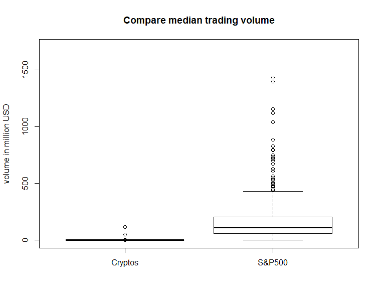

[](http://quantlet.de/)

## [](http://quantlet.de/) **LIBRObox2** [](http://quantlet.de/)

```yaml

Name of Quantlet : LIBRObox2

Published in : 'Investing with cryptocurrencies - A LIquidity Bounded Risk-return Optimization
approach'

Description : 'Provides a boxplot comparing the median trading volume of cryptocurrencies against
US stock market.'

Keywords : CRIX, cryptocurrency, crypto, investment, median, boxplot, trading volume

See also : LIBRObox1, LIBROscatter, CRIXcode, CRIXindex, CRIXvarreturn

Author : Simon Trimborn, Mingyang Li

Submitted : Wed, Jan 18 2017 by Simon Trimborn

Datafile : CryptoData.RData, S&P500comPrice.xlsx, S&P500comVolume.xlsx

Example : 'Provides a boxplot comparing the median trading volume of cryptocurrencies against the
stocks in S&P500.'

```




### R Code:
```r
rm(list = ls(all = TRUE))
# please change your working directory 
# setwd('C:/...')

# install and load packages
libraries = c("xts", "readxl", "dplyr")
lapply(libraries, function(x) if (!(x %in% installed.packages())) {
    install.packages(x)
})
lapply(libraries, library, quietly = TRUE, character.only = TRUE)

spp = read_excel('S&P500comPrice.xlsx', skip = 1, 
    col_types = c('date', rep('numeric', 500)))
spv = read_excel('S&P500comVolume.xlsx', skip = 1, 
    col_types = c('date', rep('numeric', 500)))
load('CryptoData.RData')
xts_spp  = xts(spp[, 2:ncol(spp)], order.by = spp[[1]])
xts_spv  = xts(spv[, 2:ncol(spv)], order.by = spv[[1]])
ret_spp  = diff(log(xts_spp))
xts_spva = xts_spp * xts_spv
xts_cpv  = xts(coins_vol, order.by = as.Date(row.names(coins_vol)))

mean_vol     = list()
mean_vol$cpv = apply(xts_cpv/1e+6, 2, median, na.rm = T)
mean_vol$spv = apply(xts_spva/1e+3, 2, median, na.rm = T) # volume are in 1000
LL           = max(sapply(mean_vol, length))
mean_vol = lapply(mean_vol, function(x) {  
    if (length(x)<LL) x = c(x, rep(NA, times = LL-length(x)))
    return(x) 
})
Reduce(cbind, mean_vol) %>% boxplot(names = c('Cryptos', 'S&P500'), 
    main = 'Compare median trading volume', ylim = c(0, 1700), 
    ylab = 'volume in million USD')

```
