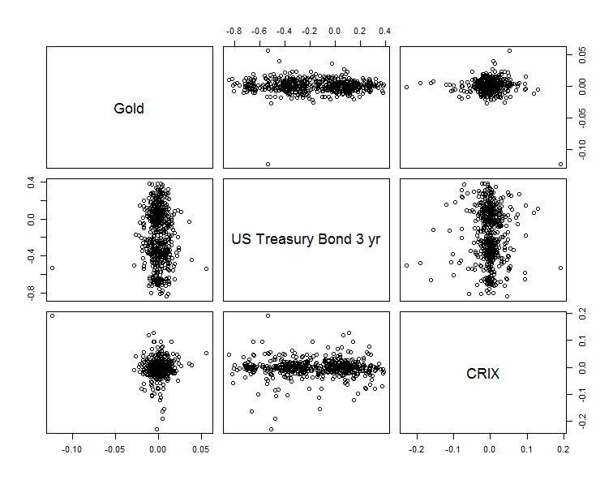

[](http://quantlet.de/)

## [](http://quantlet.de/) **LIBROscatter** [](http://quantlet.de/)

```yaml

Name of Quantlet : LIBROscatter

Published in : 'Investing with cryptocurrencies - A LIquidity Bounded Risk-return Optimization
approach'

Description : Provides the scatter plot of log returns of gold, US treasury bond 3 yr and CRIX.

Keywords : CRIX, cryptocurrency, crypto, investment, GARCH

See also : LIBRObox1, LIBRObox2, CRIXcode, CRIXindex, CRIXvarreturn

Author : Simon Trimborn, Mingyang Li

Submitted : Wed, Jan 18 2017 by Simon Trimborn

Datafile : crix.RData, gold_price.xlsx, USA_yield_curve.xlsx

Example : Scatter plot of log returns of gold, US treasury bond 3 yr and CRIX.

```




### R Code:
```r
rm(list = ls(all = TRUE))
# please change your working directory 
# setwd('C:/...')

# install and load packages
libraries = c("xts", "readxl", "fGarch")
lapply(libraries, function(x) if (!(x %in% installed.packages())) {
    install.packages(x)
})
lapply(libraries, library, quietly = TRUE, character.only = TRUE)

gold    = read_excel("gold_price.xlsx", skip = 1)
USABond = read_excel("USA_yield_curve.xlsx", skip = 1)
load("crix.RData")

goldxts        = xts(gold[,3], order.by = as.Date(gold$Code, 
    origin = "1970-01-01"))
USABondxts     = xts(USABond[,8], order.by = as.Date(USABond$Code, 
    origin = "1970-01-01"))
crixlogRet_xts = diff(log(crix))

PSI           = as.matrix(na.omit(merge(diff(log(goldxts)), 
    USABondxts, crixlogRet_xts)))
PSI_residuals = c()
for (i in 1:dim(PSI)[2]) {
    PSI_residuals = cbind(PSI_residuals, garchFit(~ garch(1,2), 
        data = PSI[,i])@residuals)
}
pairs(PSI_residuals, labels = c("Gold", "US Treasury Bond 3 yr", "CRIX"))

```
