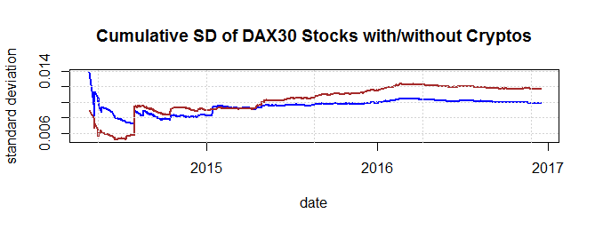
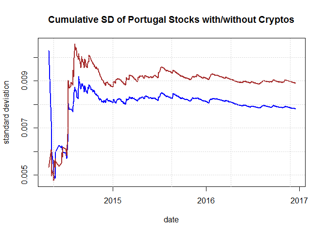

[](http://quantlet.de/)

## [](http://quantlet.de/) **LIBROsd_no_shortsell** [](http://quantlet.de/)

```yaml

Name of Quantlet : LIBROsd_no_shortsell

Published in : 'Investing with cryptocurrencies - A LIquidity Bounded Risk-return Optimization
approach'

Description : 'Add Crypto currencies to Portugal stocks or DAX30 stocks to form portfolios using
Markowitz(1952) method with shortsell constraints.'

Keywords : 'crypto, CRIX, cryptocurrency, Linear programming, portfolio, variance, plot,
time-series, returns'

Author : Mingyang Li, Simon Trimborn

Submitted : Wed, January 18, 2016 by Mingyang Li

Datafile : processed_data.RData

```






### R Code:
```r
### this is the code to plot the cumulative return of portfolios with or without
### crypto currencies under shortsell constraints

# please change your working directory 
# setwd('...')
rm(list = ls())
graphics.off()

libraries = c("xts", "plyr", "dplyr", "quadprog")
lapply(libraries, function(x) if (!(x %in% installed.packages())) {
    install.packages(x)
})
lapply(libraries, library, quietly = TRUE, character.only = TRUE)

load("processed_data.RData")

# write another Markowitz function to deal with constraints on weights
Markw2 = function(Asset, r_bar = NULL, shortsell = T) {
    require(quadprog)
    mu_hat = colMeans(Asset, na.rm = T)
    Sig_hat = cov(Asset, use = "pairwise.complete.obs")
    nn = ncol(Asset)
    TT = nrow(Asset)
    ls = rep(1, times = nn)
    outlist = list()
    
    ## define initial situations, when only the =1 constraint is implied
    DD = Sig_hat
    dd = rep(0, times = nn)
    AA = matrix(1, nrow = nn, ncol = 1)
    bb = 1
    
    ## when no target return is required
    if (is.null(r_bar) == F) {
        if (length(r_bar) != 1) 
            stop("Single return target is required.")
        AA1 = matrix(mu_hat, ncol = 1)
        bb1 = r_bar
        AA = cbind(AA, AA1)
        bb = c(bb, bb1)
    }
    if (shortsell == F) {
        AA2 = diag(1, ncol = nn, nrow = nn)
        bb2 = rep(0, times = nn)
        AA = cbind(AA, AA2)
        bb = c(bb, bb2)
    }
    
    qpsolve = solve.QP(DD, dd, AA, bb, meq = 1)
    outlist$wei_M2 = qpsolve$solution
    Asset[is.na(Asset)] = 0
    outlist$ret_M2 = Asset %*% outlist$wei_M2
    return(outlist)
}

# write a function to conduct portfolio formation with or without certain
# additional assets, here, this additional assets means crypto currencies.
add_asset = function(Asset, add, f, get, ...) {
    nc1 = NCOL(Asset)
    nc2 = NCOL(add)
    aa = cbind(Asset, add)
    aa = na.omit(aa)
    timeind = index(aa)
    bb1 = f(aa, ...)
    bb2 = f(aa[, 1:nc1], ...)
    bb = list(both = bb1, asset1 = bb2, time_index = timeind)
    return(bb)
}

# write a function to calculate statistics of a variable in a recursive way
recur_cal = function(x, f) {
    x = as.numeric(x)
    LL = length(x)
    aa = rep(0, times = LL)
    for (i in 1:LL) aa[i] = f(x[1:i])
    return(aa)
}

# for Portugal stocks
pocp_ret_nss = add_asset(Asset = ret_pop, add = ret_cpp, f = function(x) Markw2(x, 
    r_bar = 8e-04, shortsell = F)$ret_M2)
time = pocp_ret_nss$time_index
pocp_ret_nss$time_index = NULL
sapply(pocp_ret_nss, function(x) recur_cal(x, sd)) %>% xts(order.by = time) %>% 
    plot.zoo(plot.type = "single", col = c("blue", "brown"), type = "l", lwd = 2, 
        xlab = "date", ylab = "standard deviation", main = "Cumulative SD of Portugal Stocks with/without Cryptos")
grid()

# for DAX30 stocks
dacp_ret_nss = add_asset(Asset = ret_dap, add = ret_cpp, f = function(x) Markw2(x, 
    r_bar = 8e-04, shortsell = F)$ret_M2)
time = dacp_ret_nss$time_index
dacp_ret_nss$time_index = NULL
sapply(dacp_ret_nss, function(x) recur_cal(x, sd)) %>% xts(order.by = time) %>% 
    plot.zoo(plot.type = "single", col = c("blue", "brown"), type = "l", lwd = 2, 
        xlab = "date", ylab = "standard deviation", main = "Cumulative SD of DAX30 Stocks with/without Cryptos")
grid()


```
